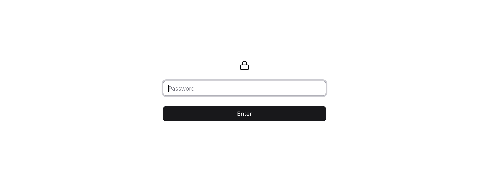

# mildly-basic-auth


[](https://crates.io/crates/mildly-basic-auth)
[](https://github.com/qrichert/mildly-basic-auth/actions)

_Basic auth with nicer UX._

> A transparent reverse proxy that shows a password page, sets a secure
> session cookie, and otherwise gets out of the way.

<picture>
  <source media="(prefers-color-scheme: dark)" srcset="./demo/dark.png">
  
</picture>

## What it is

`mildly-basic-auth` puts a password page in front of anything that
speaks HTTP. Enter the password once; it sets a session cookie and turns
into a transparent passthrough — as if it were never there.

```python
if not authenticated:
    show_password_gate()
else:
    passthrough_transparently()  # as if we're not even there...
```

It fills the awkward middle ground: HTTP Basic auth is too ugly (a
native browser dialog that never remembers you), and a full OAuth2 proxy
is far too much (Google sign-in, callback URLs, client secrets) just to
keep strangers out of a work-in-progress project or some personal docs.

## Philosophy: stupid simple

One or more environment variables for passwords, one for the upstream.
No config file to learn, no docs to read, no accounts, no database, no
Redis. Drop the container in front of your app and it works.

Everything else follows from that:

- The login page is a single self-contained HTML file (inline CSS and
  SVG, no external requests — the wall never phones home).
- Sessions are stateless. The cookie is a digest of the password used to
  log in, so there is nothing to persist, and rotating (or removing) a
  password invalidates only the sessions created with it — the others
  keep working.
- Authenticated traffic passes through untouched, streaming and
  WebSockets included.

## Cookbook

Images are published to Docker Hub as [`qrichert/mildly-basic-auth`].

[`qrichert/mildly-basic-auth`]:
  https://hub.docker.com/r/qrichert/mildly-basic-auth

### Drop-in

The whole thing is two environment variables. Point `MBA_UPSTREAM` at
the service you want to protect and publish the gate's port instead of
the app's:

```yml
services:
  auth-gate:
    image: qrichert/mildly-basic-auth:latest
    ports:
      - "80:8000"
    environment:
      MBA_PASSWORD: "Tr0ub4dor&3"
      MBA_UPSTREAM: http://app:2001
  app:
    image: traefik/whoami
    command:
      - "--port=2001"
```

Use a long, random `MBA_PASSWORD`, not something guessable like the
`Tr0ub4dor&3` above. The session cookie is a fast digest of the
password, so a leaked cookie is an offline verifier of it — a strong
secret stays safe, a weak one does not.

### Multiple passwords

Give each person or system its own password by adding
`MBA_PASSWORD_<label>` variables — the `<label>` is a free-form tag
(typically who it is for). Any of them logs in; there is no privileged
base variable, and the passwords must be distinct (startup rejects
duplicates so each can be revoked on its own):

```yml
services:
  auth-gate:
    image: qrichert/mildly-basic-auth:latest
    ports:
      - "80:8000"
    environment:
      MBA_PASSWORD_ALICE: ${ALICE_PASSWORD:?set a strong password}
      MBA_PASSWORD_BOB: ${BOB_PASSWORD:?set a strong password}
      MBA_UPSTREAM: http://app:2001
  app:
    image: traefik/whoami
    command:
      - "--port=2001"
```

Delete a variable and restart to revoke the sessions created with that
password; the others keep working. The label is only for you: the gate
authenticates anonymously and never learns who is behind a request, so
revocation is per-password, not per-person.

### Behind Caddy (TLS)

The drop-in above serves plain HTTP, so the session cookie is not
`Secure` and both the password and the token are visible on the wire.
That is fine on a trusted network, but for anything public, terminate
TLS in front. Caddy sets `X-Forwarded-Proto: https`, which flips the
cookie's `Secure` flag on automatically:

```yml
services:
  caddy:
    image: caddy:2
    ports:
      - "443:443"
    volumes:
      - ./Caddyfile:/etc/caddy/Caddyfile
  auth-gate:
    image: qrichert/mildly-basic-auth:latest
    environment:
      MBA_ADDRESS: 0.0.0.0:4630
      MBA_PASSWORD: ${MBA_PASSWORD:?set a strong password}
      MBA_UPSTREAM: http://app:2001
  app:
    image: traefik/whoami
    command:
      - "--port=2001"
```

```caddyfile
# Caddyfile
docs.example.com {
    reverse_proxy auth-gate:4630
}
```

### Without Docker

It is a single static binary. Install it from [crates.io] and hand it
the same two variables (it binds `0.0.0.0:8000` by default):

```console
$ cargo install mildly-basic-auth
$ MBA_PASSWORD='…' MBA_UPSTREAM='http://127.0.0.1:2001' mildly-basic-auth
```

[crates.io]: https://crates.io/crates/mildly-basic-auth

## Configuration

### Required

| Variable       | Required | Description                                        |
| -------------- | -------- | -------------------------------------------------- |
| `MBA_PASSWORD` | yes\*    | A password. Any configured password grants access. |
| `MBA_UPSTREAM` | yes      | Absolute `http(s)://host[:port]` to forward to.    |

### General

| Variable             | Required | Description                                           |
| -------------------- | -------- | ----------------------------------------------------- |
| `MBA_ADDRESS`        | no       | IP and port to bind. Defaults to `0.0.0.0:8000`.      |
| `MBA_PASSWORD_<tag>` | no       | An additional password; `<tag>` is a free-form label. |

\* At least one password must be set — `MBA_PASSWORD` or any
`MBA_PASSWORD_<tag>`; there is no privileged base variable. Passwords
must be distinct: startup rejects duplicates so each can be revoked
independently. Any of them logs in; removing a variable revokes the
sessions created with it.

`MBA_ADDRESS` accepts a concrete IPv4 or bracketed IPv6 address, not a
hostname, and the port must not be zero.

A missing or empty required variable, a duplicate password, or an
invalid `MBA_ADDRESS` is a hard startup error, not a silent passthrough
— the point is protection, so a misconfiguration fails loud instead of
leaving the door open.

The container listens on `0.0.0.0:8000` by default and runs as a
non-root user (UID `10001`) on a Debian-slim image.[^debian]

[^debian]:
    Debian slim, not Alpine: musl's allocator degrades under the
    per-request, multithreaded allocation a proxy does, and the
    pure-Rust TLS stack (rustls + blake3, no OpenSSL) means Alpine's
    usual glibc/OpenSSL payoff does not apply here.

### Template

The built-in password page can be translated or renamed without
replacing its HTML:

| Variable                            | Default    | Description                               |
| ----------------------------------- | ---------- | ----------------------------------------- |
| `MBA_TEMPLATE_PAGE_LANGUAGE`        | `en`       | Document language used by assistive tech. |
| `MBA_TEMPLATE_PAGE_TITLE`           | `Welcome!` | Browser tab title.                        |
| `MBA_TEMPLATE_PASSWORD_LABEL`       | `Password` | Accessible password-field label.          |
| `MBA_TEMPLATE_PASSWORD_PLACEHOLDER` | `Password` | Visible password-field placeholder.       |
| `MBA_TEMPLATE_SUBMIT_BUTTON_TEXT`   | `Enter`    | Submit-button text.                       |

For example:

```yaml
environment:
  MBA_TEMPLATE_PAGE_LANGUAGE: "fr"
  MBA_TEMPLATE_PAGE_TITLE: "Mon site"
  MBA_TEMPLATE_PASSWORD_LABEL: "Mot de passe"
  MBA_TEMPLATE_PASSWORD_PLACEHOLDER: "Votre mot de passe"
  MBA_TEMPLATE_SUBMIT_BUTTON_TEXT: "Entrer"
```

An unset variable uses its default. An explicitly empty value removes
that text. Values are inserted as text, not HTML, and are escaped before
the page is served. A configured override that is not valid Unicode is a
startup error.

## Roadmap

v0 is plain-passwords-in-env-vars with a fixed template. Planned next:

- **More auth methods:** pre-hashed passwords, and possibly a
  header-only bearer-token check. Pre-hashed passwords will be
  BLAKE3-only — the login path hashes with BLAKE3 and the cookie _is_
  that digest, so no other algorithm could match. A possible explicit
  format is `blake3:<hex>`; the exact syntax remains undecided. A
  pre-hash is still a password-equivalent bearer secret: it keeps the
  plaintext out of configuration but does not make configuration
  disclosure harmless.
- **Config beyond env vars:** an env file or a YAML config file (via
  `MBA_CONFIG_FILE` or discovery).
- **Custom template:** full override via `MBA_TEMPLATE_FILE` or a bind
  mount to `/etc/template.html`, loaded at startup, with a template
  engine to interpolate variables and conditionally render fields per
  auth method.
- **More settings:** auth method, logging on/off, session lifetime.
- **Authentication hardening:** optional failed-login throttling, once
  trusted client-IP handling is configurable.

### Non-goals

General traffic controls such as rate limiting and host allow-listing
belong at the edge, not here. Also deliberately out of scope,
permanently: LDAP, OAuth, an admin panel, policy rules, Redis, MFA/TOTP,
and SSO.
